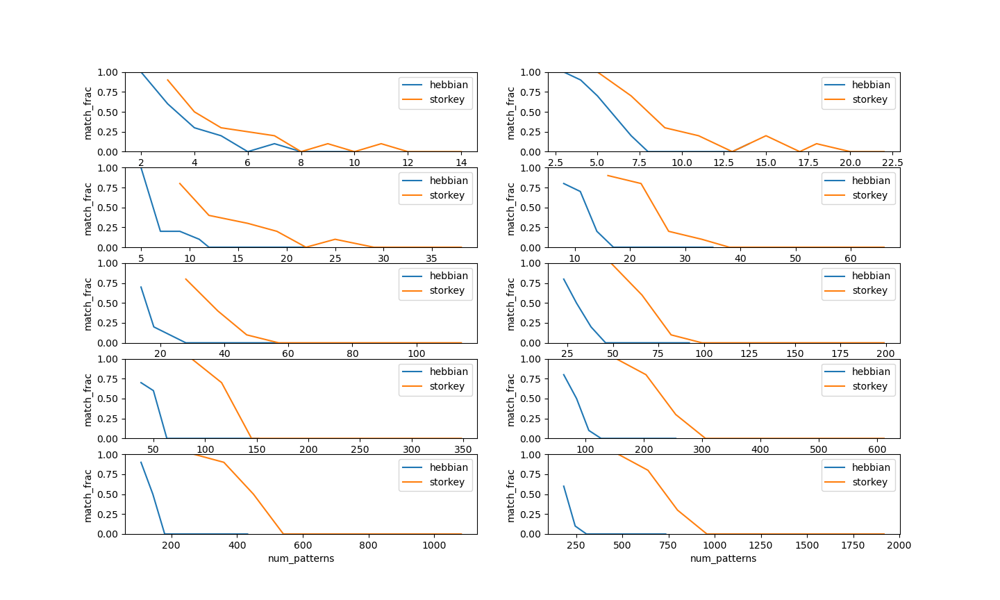
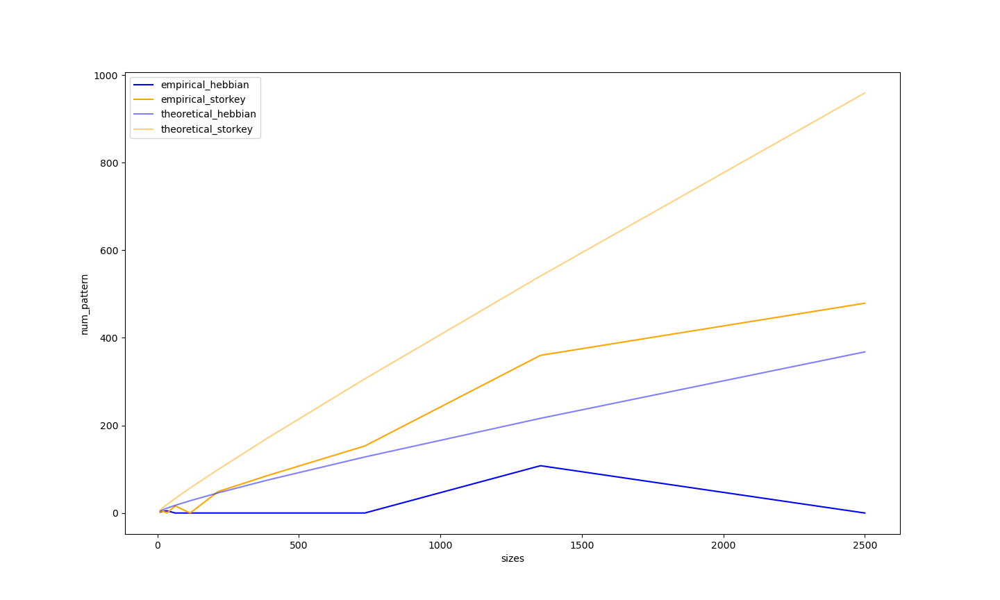
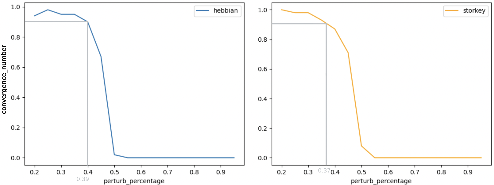

# Summary of the Hopfield Projet, team 33, BIO-210 :  

## Brief introduction : 

This project implements an iterative process that allows us, by using the Hopfield network model, to retrieve a stored (memorised) pattern from a collection of patterns. 

## 1. Capacity of the Hopfiled network 

An important feature of a Hopfield network is the storage capacity. This corresponds to the number of patterns that our model can store : 
The network is said to have stored a pattern if, when presented with a perturbed version of such pattern, the dynamical system converges to the original one. 

In order to test the capacity of the network, we considered 10 networks of size ranging from 10 to 2500 with logarithmically arranged neuron numbers. 

`(sizes=[10, 18, 34, 63, 116, 215, 397, 733, 1354, 2500])`

We then ran 10 trials, changing the number of patterns each time, for each network size by running the dynamical system varying the initial pattern. We applied a perturbation by changing 20% of the values of each base pattern. We then looked at how many patterns converged back to the original one, in order to compute the fraction of retrieved patterns. We have therefore a total of 200 experiments. 

After running all the experiments, we obtained the following results : 

*You will be able to find all our results in hdf5 format in the summary folder or in markdown format in the **3.** .*

We can observe that very quickly the capacity drops even with very small numbers of patterns. This could be due to the weakness of our model.

Following the study of the capacity of our model, we wanted to compare our empirical capacity curves with their theoretical estimates. For that, we only focused on the number of patterns that can be retrieved with more than 90% probability.

We can see that, for each rule, the empirical curve is lower than the theoretical one. The tendencies are the same but for the same neuronal network size, less patterns are capable to be stored  The difference is most likely due to the small number of trials which we do (10) for each experiment. If we would increase this number, then our curves would most likely be much similar to the theoretical estimates. A slight error in the capacity calculation could also be the source of this imprecision. 

## 2. Robustness of the Network 

After testing the capacity of the Network, we want to test its robustness by doing the same experiment as previously but with an increasing percentage of pertubations (increasing by 5% at each iteration). To do so, we used the same sizes as previously and a pattern containing t=2 patterns each time. Our goal is to obtain the percent of perturbations at which the patterns stop converging more than 10% of the time, i.e returns a convergence below 90%. 

After runing the experiment, we obtain the following results :

We can see that we obtain a critical percent of perturbations around 39% using the Hebbian rule and 37% when using the Storkey rule. We can't distinguish a major difference between the two rules in this case. As the perturbations are random, the percentage varies a little bit between each trial.

*You will be able to find all our results in hdf5 format in the summary folder or in markdown format in the **3.** .*

## 3. Value tables 

Here, you will be able to find all the value tables of the previous points which were used to plot the graphs.

### Capacity plot values
 
|    |   network_size | weight_rule   |   num_patterns |   num_pertub |   match_frac |
|---:|---------------:|:--------------|---------------:|-------------:|-------------:|
|  0 |             10 | hebbian       |              2 |            2 |          1   |
|  1 |             10 | hebbian       |              3 |            2 |          0.6 |
|  2 |             10 | hebbian       |              4 |            2 |          0.3 |
|  3 |             10 | hebbian       |              5 |            2 |          0.2 |
|  4 |             10 | hebbian       |              5 |            2 |          0.2 |
|  5 |             10 | hebbian       |              6 |            2 |          0   |
|  6 |             10 | hebbian       |              7 |            2 |          0.1 |
|  7 |             10 | hebbian       |              8 |            2 |          0   |
|  8 |             10 | hebbian       |              9 |            2 |          0   |
|  9 |             10 | hebbian       |             10 |            2 |          0   |
|    |   network_size | weight_rule   |   num_patterns |   num_pertub |   match_frac |
|---:|---------------:|:--------------|---------------:|-------------:|-------------:|
|  0 |             10 | storkey       |              3 |            2 |          0.9 |
|  1 |             10 | storkey       |              4 |            2 |          0.5 |
|  2 |             10 | storkey       |              5 |            2 |          0.3 |
|  3 |             10 | storkey       |              7 |            2 |          0.2 |
|  4 |             10 | storkey       |              8 |            2 |          0   |
|  5 |             10 | storkey       |              9 |            2 |          0.1 |
|  6 |             10 | storkey       |             10 |            2 |          0   |
|  7 |             10 | storkey       |             11 |            2 |          0.1 |
|  8 |             10 | storkey       |             12 |            2 |          0   |
|  9 |             10 | storkey       |             14 |            2 |          0   |
|    |   network_size | weight_rule   |   num_patterns |   num_pertub |   match_frac |
|---:|---------------:|:--------------|---------------:|-------------:|-------------:|
|  0 |             18 | hebbian       |              3 |            3 |          1   |
|  1 |             18 | hebbian       |              4 |            3 |          0.9 |
|  2 |             18 | hebbian       |              5 |            3 |          0.7 |
|  3 |             18 | hebbian       |              7 |            3 |          0.2 |
|  4 |             18 | hebbian       |              8 |            3 |          0   |
|  5 |             18 | hebbian       |              9 |            3 |          0   |
|  6 |             18 | hebbian       |             10 |            3 |          0   |
|  7 |             18 | hebbian       |             11 |            3 |          0   |
|  8 |             18 | hebbian       |             13 |            3 |          0   |
|  9 |             18 | hebbian       |             14 |            3 |          0.1 |
|    |   network_size | weight_rule   |   num_patterns |   num_pertub |   match_frac |
|---:|---------------:|:--------------|---------------:|-------------:|-------------:|
|  0 |             18 | storkey       |              5 |            3 |          1   |
|  1 |             18 | storkey       |              7 |            3 |          0.7 |
|  2 |             18 | storkey       |              9 |            3 |          0.3 |
|  3 |             18 | storkey       |             11 |            3 |          0.2 |
|  4 |             18 | storkey       |             13 |            3 |          0   |
|  5 |             18 | storkey       |             15 |            3 |          0.2 |
|  6 |             18 | storkey       |             17 |            3 |          0   |
|  7 |             18 | storkey       |             18 |            3 |          0.1 |
|  8 |             18 | storkey       |             20 |            3 |          0   |
|  9 |             18 | storkey       |             22 |            3 |          0   |
|    |   network_size | weight_rule   |   num_patterns |   num_pertub |   match_frac |
|---:|---------------:|:--------------|---------------:|-------------:|-------------:|
|  0 |             34 | hebbian       |              5 |            6 |          1   |
|  1 |             34 | hebbian       |              7 |            6 |          0.2 |
|  2 |             34 | hebbian       |              9 |            6 |          0.2 |
|  3 |             34 | hebbian       |             11 |            6 |          0.1 |
|  4 |             34 | hebbian       |             12 |            6 |          0   |
|  5 |             34 | hebbian       |             14 |            6 |          0   |
|  6 |             34 | hebbian       |             16 |            6 |          0   |
|  7 |             34 | hebbian       |             18 |            6 |          0   |
|  8 |             34 | hebbian       |             20 |            6 |          0   |
|  9 |             34 | hebbian       |             22 |            6 |          0   |
|    |   network_size | weight_rule   |   num_patterns |   num_pertub |   match_frac |
|---:|---------------:|:--------------|---------------:|-------------:|-------------:|
|  0 |             34 | storkey       |              9 |            6 |          0.8 |
|  1 |             34 | storkey       |             12 |            6 |          0.4 |
|  2 |             34 | storkey       |             16 |            6 |          0.3 |
|  3 |             34 | storkey       |             19 |            6 |          0.2 |
|  4 |             34 | storkey       |             22 |            6 |          0   |
|  5 |             34 | storkey       |             25 |            6 |          0.1 |
|  6 |             34 | storkey       |             29 |            6 |          0   |
|  7 |             34 | storkey       |             32 |            6 |          0   |
|  8 |             34 | storkey       |             35 |            6 |          0   |
|  9 |             34 | storkey       |             38 |            6 |          0   |
|    |   network_size | weight_rule   |   num_patterns |   num_pertub |   match_frac |
|---:|---------------:|:--------------|---------------:|-------------:|-------------:|
|  0 |             63 | hebbian       |              8 |           12 |          0.8 |
|  1 |             63 | hebbian       |             11 |           12 |          0.7 |
|  2 |             63 | hebbian       |             14 |           12 |          0.2 |
|  3 |             63 | hebbian       |             17 |           12 |          0   |
|  4 |             63 | hebbian       |             20 |           12 |          0   |
|  5 |             63 | hebbian       |             23 |           12 |          0   |
|  6 |             63 | hebbian       |             26 |           12 |          0   |
|  7 |             63 | hebbian       |             29 |           12 |          0   |
|  8 |             63 | hebbian       |             32 |           12 |          0   |
|  9 |             63 | hebbian       |             35 |           12 |          0   |
|    |   network_size | weight_rule   |   num_patterns |   num_pertub |   match_frac |
|---:|---------------:|:--------------|---------------:|-------------:|-------------:|
|  0 |             63 | storkey       |             16 |           12 |          0.9 |
|  1 |             63 | storkey       |             22 |           12 |          0.8 |
|  2 |             63 | storkey       |             27 |           12 |          0.2 |
|  3 |             63 | storkey       |             33 |           12 |          0.1 |
|  4 |             63 | storkey       |             38 |           12 |          0   |
|  5 |             63 | storkey       |             44 |           12 |          0   |
|  6 |             63 | storkey       |             49 |           12 |          0   |
|  7 |             63 | storkey       |             55 |           12 |          0   |
|  8 |             63 | storkey       |             60 |           12 |          0   |
|  9 |             63 | storkey       |             66 |           12 |          0   |
|    |   network_size | weight_rule   |   num_patterns |   num_pertub |   match_frac |
|---:|---------------:|:--------------|---------------:|-------------:|-------------:|
|  0 |            116 | hebbian       |             14 |           23 |          0.7 |
|  1 |            116 | hebbian       |             18 |           23 |          0.2 |
|  2 |            116 | hebbian       |             23 |           23 |          0.1 |
|  3 |            116 | hebbian       |             28 |           23 |          0   |
|  4 |            116 | hebbian       |             32 |           23 |          0   |
|  5 |            116 | hebbian       |             37 |           23 |          0   |
|  6 |            116 | hebbian       |             42 |           23 |          0   |
|  7 |            116 | hebbian       |             46 |           23 |          0   |
|  8 |            116 | hebbian       |             51 |           23 |          0   |
|  9 |            116 | hebbian       |             56 |           23 |          0   |
|    |   network_size | weight_rule   |   num_patterns |   num_pertub |   match_frac |
|---:|---------------:|:--------------|---------------:|-------------:|-------------:|
|  0 |            116 | storkey       |             28 |           23 |          0.8 |
|  1 |            116 | storkey       |             38 |           23 |          0.4 |
|  2 |            116 | storkey       |             47 |           23 |          0.1 |
|  3 |            116 | storkey       |             57 |           23 |          0   |
|  4 |            116 | storkey       |             66 |           23 |          0   |
|  5 |            116 | storkey       |             76 |           23 |          0   |
|  6 |            116 | storkey       |             85 |           23 |          0   |
|  7 |            116 | storkey       |             95 |           23 |          0   |
|  8 |            116 | storkey       |            104 |           23 |          0   |
|  9 |            116 | storkey       |            114 |           23 |          0   |
|    |   network_size | weight_rule   |   num_patterns |   num_pertub |   match_frac |
|---:|---------------:|:--------------|---------------:|-------------:|-------------:|
|  0 |            215 | hebbian       |             23 |           43 |          0.8 |
|  1 |            215 | hebbian       |             30 |           43 |          0.5 |
|  2 |            215 | hebbian       |             38 |           43 |          0.2 |
|  3 |            215 | hebbian       |             46 |           43 |          0   |
|  4 |            215 | hebbian       |             53 |           43 |          0   |
|  5 |            215 | hebbian       |             61 |           43 |          0   |
|  6 |            215 | hebbian       |             69 |           43 |          0   |
|  7 |            215 | hebbian       |             76 |           43 |          0   |
|  8 |            215 | hebbian       |             84 |           43 |          0   |
|  9 |            215 | hebbian       |             92 |           43 |          0   |
|    |   network_size | weight_rule   |   num_patterns |   num_pertub |   match_frac |
|---:|---------------:|:--------------|---------------:|-------------:|-------------:|
|  0 |            215 | storkey       |             49 |           43 |          1   |
|  1 |            215 | storkey       |             66 |           43 |          0.6 |
|  2 |            215 | storkey       |             82 |           43 |          0.1 |
|  3 |            215 | storkey       |             99 |           43 |          0   |
|  4 |            215 | storkey       |            116 |           43 |          0   |
|  5 |            215 | storkey       |            132 |           43 |          0   |
|  6 |            215 | storkey       |            149 |           43 |          0   |
|  7 |            215 | storkey       |            165 |           43 |          0   |
|  8 |            215 | storkey       |            182 |           43 |          0   |
|  9 |            215 | storkey       |            199 |           43 |          0   |
|    |   network_size | weight_rule   |   num_patterns |   num_pertub |   match_frac |
|---:|---------------:|:--------------|---------------:|-------------:|-------------:|
|  0 |            397 | hebbian       |             38 |           79 |          0.7 |
|  1 |            397 | hebbian       |             50 |           79 |          0.6 |
|  2 |            397 | hebbian       |             63 |           79 |          0   |
|  3 |            397 | hebbian       |             76 |           79 |          0   |
|  4 |            397 | hebbian       |             89 |           79 |          0   |
|  5 |            397 | hebbian       |            101 |           79 |          0   |
|  6 |            397 | hebbian       |            114 |           79 |          0   |
|  7 |            397 | hebbian       |            127 |           79 |          0   |
|  8 |            397 | hebbian       |            140 |           79 |          0   |
|  9 |            397 | hebbian       |            152 |           79 |          0   |
|    |   network_size | weight_rule   |   num_patterns |   num_pertub |   match_frac |
|---:|---------------:|:--------------|---------------:|-------------:|-------------:|
|  0 |            397 | storkey       |             87 |           79 |          1   |
|  1 |            397 | storkey       |            116 |           79 |          0.7 |
|  2 |            397 | storkey       |            145 |           79 |          0   |
|  3 |            397 | storkey       |            174 |           79 |          0   |
|  4 |            397 | storkey       |            203 |           79 |          0   |
|  5 |            397 | storkey       |            232 |           79 |          0   |
|  6 |            397 | storkey       |            261 |           79 |          0   |
|  7 |            397 | storkey       |            290 |           79 |          0   |
|  8 |            397 | storkey       |            319 |           79 |          0   |
|  9 |            397 | storkey       |            348 |           79 |          0   |
|    |   network_size | weight_rule   |   num_patterns |   num_pertub |   match_frac |
|---:|---------------:|:--------------|---------------:|-------------:|-------------:|
|  0 |            733 | hebbian       |             63 |          146 |          0.8 |
|  1 |            733 | hebbian       |             85 |          146 |          0.5 |
|  2 |            733 | hebbian       |            106 |          146 |          0.1 |
|  3 |            733 | hebbian       |            127 |          146 |          0   |
|  4 |            733 | hebbian       |            149 |          146 |          0   |
|  5 |            733 | hebbian       |            170 |          146 |          0   |
|  6 |            733 | hebbian       |            191 |          146 |          0   |
|  7 |            733 | hebbian       |            213 |          146 |          0   |
|  8 |            733 | hebbian       |            234 |          146 |          0   |
|  9 |            733 | hebbian       |            255 |          146 |          0   |
|    |   network_size | weight_rule   |   num_patterns |   num_pertub |   match_frac |
|---:|---------------:|:--------------|---------------:|-------------:|-------------:|
|  0 |            733 | storkey       |            153 |          146 |          1   |
|  1 |            733 | storkey       |            204 |          146 |          0.8 |
|  2 |            733 | storkey       |            255 |          146 |          0.3 |
|  3 |            733 | storkey       |            306 |          146 |          0   |
|  4 |            733 | storkey       |            357 |          146 |          0   |
|  5 |            733 | storkey       |            408 |          146 |          0   |
|  6 |            733 | storkey       |            459 |          146 |          0   |
|  7 |            733 | storkey       |            510 |          146 |          0   |
|  8 |            733 | storkey       |            561 |          146 |          0   |
|  9 |            733 | storkey       |            612 |          146 |          0   |
|    |   network_size | weight_rule   |   num_patterns |   num_pertub |   match_frac |
|---:|---------------:|:--------------|---------------:|-------------:|-------------:|
|  0 |           1354 | hebbian       |            108 |          270 |          0.9 |
|  1 |           1354 | hebbian       |            144 |          270 |          0.5 |
|  2 |           1354 | hebbian       |            180 |          270 |          0   |
|  3 |           1354 | hebbian       |            216 |          270 |          0   |
|  4 |           1354 | hebbian       |            252 |          270 |          0   |
|  5 |           1354 | hebbian       |            288 |          270 |          0   |
|  6 |           1354 | hebbian       |            324 |          270 |          0   |
|  7 |           1354 | hebbian       |            360 |          270 |          0   |
|  8 |           1354 | hebbian       |            396 |          270 |          0   |
|  9 |           1354 | hebbian       |            432 |          270 |          0   |
|    |   network_size | weight_rule   |   num_patterns |   num_pertub |   match_frac |
|---:|---------------:|:--------------|---------------:|-------------:|-------------:|
|  0 |           1354 | storkey       |            270 |          270 |          1   |
|  1 |           1354 | storkey       |            360 |          270 |          0.9 |
|  2 |           1354 | storkey       |            450 |          270 |          0.5 |
|  3 |           1354 | storkey       |            541 |          270 |          0   |
|  4 |           1354 | storkey       |            631 |          270 |          0   |
|  5 |           1354 | storkey       |            721 |          270 |          0   |
|  6 |           1354 | storkey       |            811 |          270 |          0   |
|  7 |           1354 | storkey       |            901 |          270 |          0   |
|  8 |           1354 | storkey       |            991 |          270 |          0   |
|  9 |           1354 | storkey       |           1082 |          270 |          0   |
|    |   network_size | weight_rule   |   num_patterns |   num_pertub |   match_frac |
|---:|---------------:|:--------------|---------------:|-------------:|-------------:|
|  0 |           2500 | hebbian       |            183 |          500 |          0.6 |
|  1 |           2500 | hebbian       |            245 |          500 |          0.1 |
|  2 |           2500 | hebbian       |            306 |          500 |          0   |
|  3 |           2500 | hebbian       |            367 |          500 |          0   |
|  4 |           2500 | hebbian       |            429 |          500 |          0   |
|  5 |           2500 | hebbian       |            490 |          500 |          0   |
|  6 |           2500 | hebbian       |            551 |          500 |          0   |
|  7 |           2500 | hebbian       |            613 |          500 |          0   |
|  8 |           2500 | hebbian       |            674 |          500 |          0   |
|  9 |           2500 | hebbian       |            735 |          500 |          0   |
|    |   network_size | weight_rule   |   num_patterns |   num_pertub |   match_frac |
|---:|---------------:|:--------------|---------------:|-------------:|-------------:|
|  0 |           2500 | storkey       |            479 |          500 |          1   |
|  1 |           2500 | storkey       |            639 |          500 |          0.8 |
|  2 |           2500 | storkey       |            799 |          500 |          0.3 |
|  3 |           2500 | storkey       |            958 |          500 |          0   |
|  4 |           2500 | storkey       |           1118 |          500 |          0   |
|  5 |           2500 | storkey       |           1278 |          500 |          0   |
|  6 |           2500 | storkey       |           1438 |          500 |          0   |
|  7 |           2500 | storkey       |           1598 |          500 |          0   |
|  8 |           2500 | storkey       |           1758 |          500 |          0   |
|  9 |           2500 | storkey       |           1917 |          500 |          0   |

### Robustness plot values

Hebbian's robustness table : 

|    |   perturb_percentage |   match_percentage |
|---:|---------------------:|-------------------:|
|  0 |                 0.2  |               0.94 |
|  1 |                 0.25 |               0.98 |
|  2 |                 0.3  |               0.95 |
|  3 |                 0.35 |               0.95 |
|  4 |                 0.4  |               0.9  |
|  5 |                 0.45 |               0.67 |
|  6 |                 0.5  |               0.02 |
|  7 |                 0.55 |               0    |
|  8 |                 0.6  |               0    |
|  9 |                 0.65 |               0    |
| 10 |                 0.7  |               0    |
| 11 |                 0.75 |               0    |
| 12 |                 0.8  |               0    |
| 13 |                 0.85 |               0    |
| 14 |                 0.9  |               0    |
| 15 |                 0.95 |               0    |

Storkey's robustness table:

|    |   perturb_percentage |   match_percentage |
|---:|---------------------:|-------------------:|
|  0 |                 0.2  |               1    |
|  1 |                 0.25 |               0.98 |
|  2 |                 0.3  |               0.98 |
|  3 |                 0.35 |               0.93 |
|  4 |                 0.4  |               0.87 |
|  5 |                 0.45 |               0.71 |
|  6 |                 0.5  |               0.08 |
|  7 |                 0.55 |               0    |
|  8 |                 0.6  |               0    |
|  9 |                 0.65 |               0    |
| 10 |                 0.7  |               0    |
| 11 |                 0.75 |               0    |
| 12 |                 0.8  |               0    |
| 13 |                 0.85 |               0    |
| 14 |                 0.9  |               0    |
| 15 |                 0.95 |               0    |
